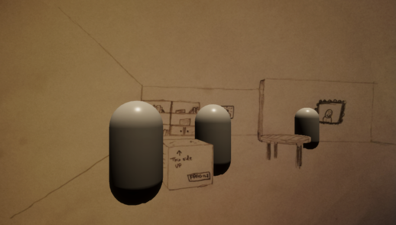

# PreRenderedBackgroundsHDRP

Implementation of pre-rendered backgrounds (like in older PS1 3D games) in Unity, using HDRP with custom passes.

## How it works

There are two main use cases for pre-rendering:
1. You want a really complex background that you cannot afford to render at runtime. You will then create this background, pre-render it, and load the pre-rendered textures unmodified.
2. You want to hand-draw the backgrounds, but also have depth so 3D characters can move around inside them. You would then first create a simple scene, without paying much attention to the materials. Then you pre-render the scene, open the pre-rendered colour texture in a photo editor such as GIMP, draw your pretty scene using the pre-rendered background as a reference, save, and finally import the modified texture.

This method has one obvious limitation: **The camera can't move!**. This was a tradeoff that they made in many classic games, such as Final Fantasy 7 - 9 and Resident Evil 2.

We pre-render (the background of) the scene once, and save the colour texture and depth texture to a file (stored in Assets/StreamingAssets/SceneName/CameraName). Artists can modify these textures (most interestingly the colour texture) before importing them again, to create interesting backgrounds. During gameplay, we import these textures and blit them to the main colour render target and depth render target. This ensures that any dynamic geometry rendered after this stage will naturally become a part of the scene (the depth will be respected).

This is implemented using two CustomPass classes: [BlitPass](Assets/Scripts/BlitPass.cs) and [PreRenderPass](Assets/Scripts/PreRenderPass.cs)

## How to use the sample scene

Open the sample scene for an example.

To pre-render the scene and save the colour and depth texture to file, Select the "PrerenderingCamera" GameObject and click "Pre-render scene and save" in the custom inspector.

To load the pre-rendered textures, click "Load pre-rendered scene".

# Cameras

If you want more cameras, you should drag-and-drop `Assets/Prefabs/PrerenderingCamera.prefab` into your scene.

# Tags

The "PreRederedGeometry" tag is for the background scene geometry. All objects with this tag will be visible when pre-rendering, and hidden when using the pre-rendered textures (during gameplay).

The "DynamicGeometry" tag is for all dynamic geometry that can move around during gameplay, such as characters. All objects with this tag will be hidden during pre-rendering, and visible when using the pre-rendered textures (during gameplay).
